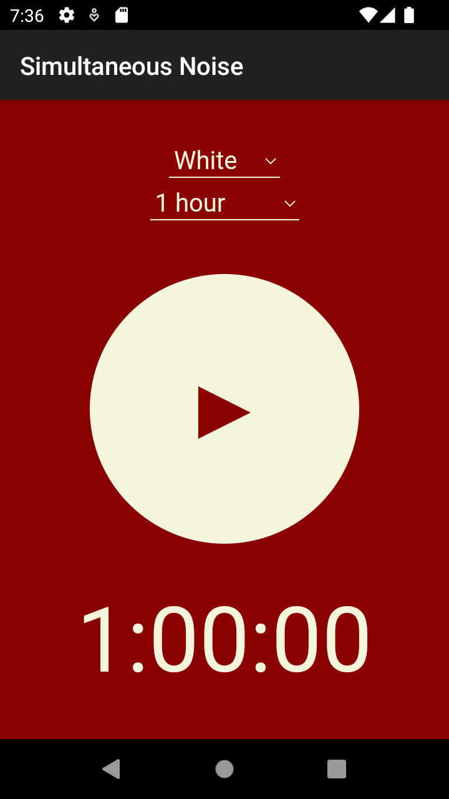

## Simultaneous Noise
Basic Android WebView app that plays white noise independently of other media, including music and podcasts. Includes a sleep timer function.

Noise player functionality is taken directly from [Soothy](https://codeberg.org/ltguillaume/soothy) by ltGuillaume. Instead of having to host it separately, it is wrapped in a simple WebView app, code for which was taken from [Joshua Tzucker's template](https://joshuatz.com/posts/2021/webviewassetloader-webviewclient-kotlin/).

The app is fully self-contained and no internet, filesystem, or other permissions are necessary.

**ToDo**

 - Independent volume control for noises
 - Iron out potential compatibility issues. App behaves slightly different between virtual and physical Android devices. Default domain for WebViewAssetLoader is used and may conflict with other apps doing the same.
 - Code cleanup and optimization as necessary. I am very new to coding for Android.

**License**
This program is free software: you can redistribute it and/or modify it under the terms of the [GNU General Public License](https://www.gnu.org/licenses/gpl.html) as published by the Free Software Foundation, either version 3 of the License, or (at your option) any later version.

This program is distributed in the hope that it will be useful, but WITHOUT ANY WARRANTY; without even the implied warranty of MERCHANTABILITY or FITNESS FOR A PARTICULAR PURPOSE. See the [GNU General Public License](https://www.gnu.org/licenses/gpl.html) for more details.

**Noises:**

-   grey: [Gray noise](https://commons.wikimedia.org/w/index.php?title=File%3AGray_noise.ogg) by [Omegatron](https://commons.wikimedia.org/wiki/User:Omegatron); public domain.
-   grey 2: [Inverse ITU-R 468 weighted "grey noise"](https://commons.wikimedia.org/w/index.php?title=File%3AInverse_ITU-R_468_weighted_%22grey_noise%22.ogg) by CapoeiraES; [Creative Commons Attribution-Share Alike 4.0 International](https://creativecommons.org/licenses/by-sa/4.0/deed.en) license
-   white: [White-noise-sound-20sec-mono-44100Hz](https://commons.wikimedia.org/w/index.php?title=File%3AWhite-noise-sound-20sec-mono-44100Hz.ogg) by [Jorge Stolfi](https://commons.wikimedia.org/wiki/User:Jorge_Stolfi); [Creative Commons Attribution-Share Alike 3.0 Unported](https://creativecommons.org/licenses/by-sa/3.0/deed.en) license
-   pink: [Pink noise](https://commons.wikimedia.org/w/index.php?title=File%3APink_noise.ogg) by [Omegatron](https://commons.wikimedia.org/wiki/User:Omegatron); Creative Commons Attribution-Share Alike [3.0 Unported](https://creativecommons.org/licenses/by-sa/3.0/deed.en), [2.5 Generic](https://creativecommons.org/licenses/by-sa/2.5/deed.en), [2.0 Generic](https://creativecommons.org/licenses/by-sa/2.0/deed.en) and [1.0 Generic](https://creativecommons.org/licenses/by-sa/1.0/deed.en) license
-   brown: [Brownnoise](https://en.wikipedia.org/wiki/File:Brownnoise.ogg) by Kieff; public domain
-   purple: [Purple noise](https://commons.wikimedia.org/w/index.php?title=File%3APurple_noise.ogg) by [Omegatron](https://commons.wikimedia.org/wiki/User:Omegatron); Creative Commons Attribution-Share Alike [3.0 Unported](https://creativecommons.org/licenses/by-sa/3.0/deed.en), [2.5 Generic](https://creativecommons.org/licenses/by-sa/2.5/deed.en), [2.0 Generic](https://creativecommons.org/licenses/by-sa/2.0/deed.en) and [1.0 Generic](https://creativecommons.org/licenses/by-sa/1.0/deed.en) license
